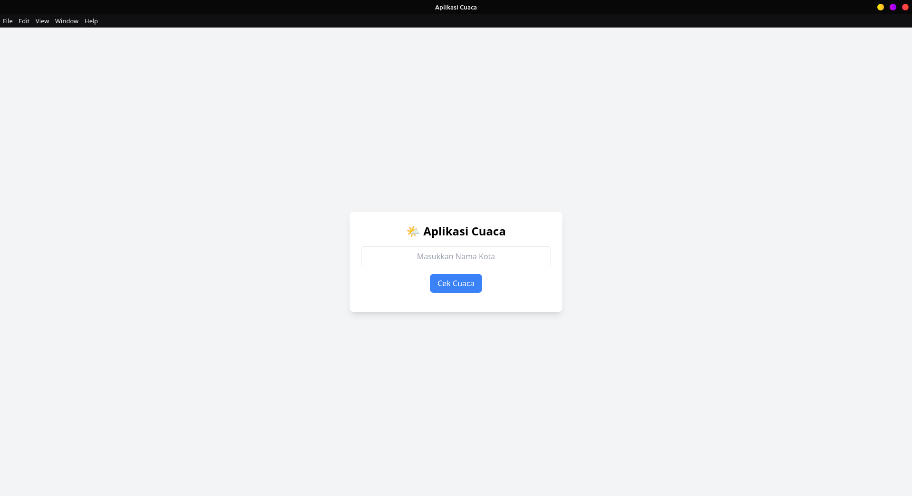

# Aplikasi Cuaca Sederhana

## 📋 Deskripsi

Aplikasi Cuaca Sederhana adalah aplikasi desktop yang memungkinkan pengguna untuk melihat informasi cuaca terkini dan prakiraan untuk lokasi yang diinginkan. Aplikasi ini dibangun menggunakan Electron.js dan memanfaatkan API OpenWeatherMap.

## ✨ Fitur

- 🌦️ Tampilkan kondisi cuaca saat ini
- 🔍 Pencarian lokasi berdasarkan nama kota
- 🌡️ Tampilan suhu dalam Celsius dan Fahrenheit
- 🌍 Mendukung lokasi di seluruh dunia

## 🖼️ Screenshot



## 🛠️ Teknologi yang Digunakan

- [Electron.js](https://www.electronjs.org/) - Framework untuk membangun aplikasi desktop cross-platform
- [Node.js](https://nodejs.org/) - Runtime JavaScript
- [OpenWeatherMap API](https://openweathermap.org/api) - Penyedia data cuaca
- [Bootstrap](https://getbootstrap.com/) - Framework CSS untuk UI yang responsif

## ⚙️ Instalasi

```bash
# Clone repository
git clone https://github.com/habibi-source/aplikasi-cuaca-sederhana.git

# Pindah ke direktori proyek
cd aplikasi-cuaca-sederhana

# Install dependencies
npm install

# Jalankan aplikasi
npm start
```

## 🔧 Konfigurasi

Untuk menggunakan aplikasi ini, Anda perlu mendapatkan API key dari [OpenWeatherMap](https://openweathermap.org/api):

1. Daftar akun di OpenWeatherMap
2. Dapatkan API Key
3. Salin file `.env.example` menjadi `.env`
4. Tambahkan API Key Anda di file `.env`

```
WEATHER_API_KEY=your_api_key_here
```

## 📝 Penggunaan

1. Masukkan nama kota di kolom pencarian
2. Tekan Enter atau klik tombol "Cari"
3. Lihat informasi cuaca saat ini dan prakiraan 5 hari ke depan

## 🤝 Kontribusi

Kontribusi selalu diterima dengan senang hati:

1. Fork repository
2. Buat branch baru (`git checkout -b fitur-baru`)
3. Commit perubahan Anda (`git commit -m 'Menambahkan fitur baru'`)
4. Push ke branch (`git push origin fitur-baru`)
5. Buat Pull Request

## 📞 Kontak

Habibi - [@habibi_source]

Link Proyek: [https://github.com/habibi-source/aplikasi-cuaca-sederhana](https://github.com/habibi-source/aplikasi-cuaca-sederhana)